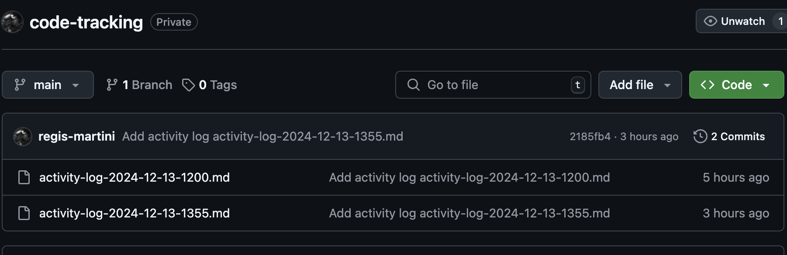

# Developer Activity Journal README

Welcome to the Developer Activity Journal extension! This extension logs projects, files, and basic actions taken on these resources, tracking the time spent on each file. It syncs with a GitHub repository of the user's choice at a user-defined frequency, allowing the user to maintain a journal of actions performed in VS Code.

## Features

- Logs time spent on each file.
- Tracks basic actions on files and projects.
- Syncs with a GitHub repository at user-defined intervals.

> Tip: Utilize animations to showcase your extension effectively. Short, focused animations are recommended.

## Requirements

- Visual Studio Code
- A GitHub account for repository synchronization

## Extension Settings

This extension contributes the following settings:

* `activityJournal.enable`: Enable/disable the extension.
* `activityJournal.syncFrequency`: Set the frequency of synchronization with the GitHub repository.

## Known Issues

Please refer to the [issues section](https://github.com/your-repo/issues) for known issues and report any new ones.

## Release Notes

### 1.0.0

- Initial release of Developer Activity Journal.

## Following Extension Guidelines

Ensure that you've read through the extension guidelines and follow the best practices for creating your extension.

* [Extension Guidelines](https://code.visualstudio.com/api/references/extension-guidelines)

## Working with Markdown

You can author your README using Visual Studio Code. Here are some useful editor keyboard shortcuts:

* Split the editor (`Cmd+\` on macOS or `Ctrl+\` on Windows and Linux).
* Toggle preview (`Shift+Cmd+V` on macOS or `Shift+Ctrl+V` on Windows and Linux).
* Press `Ctrl+Space` (Windows, Linux, macOS) to see a list of Markdown snippets.

## For More Information

* [Visual Studio Code's Markdown Support](http://code.visualstudio.com/docs/languages/markdown)
* [Markdown Syntax Reference](https://help.github.com/articles/markdown-basics/)

**Enjoy using Developer Activity Journal!**
